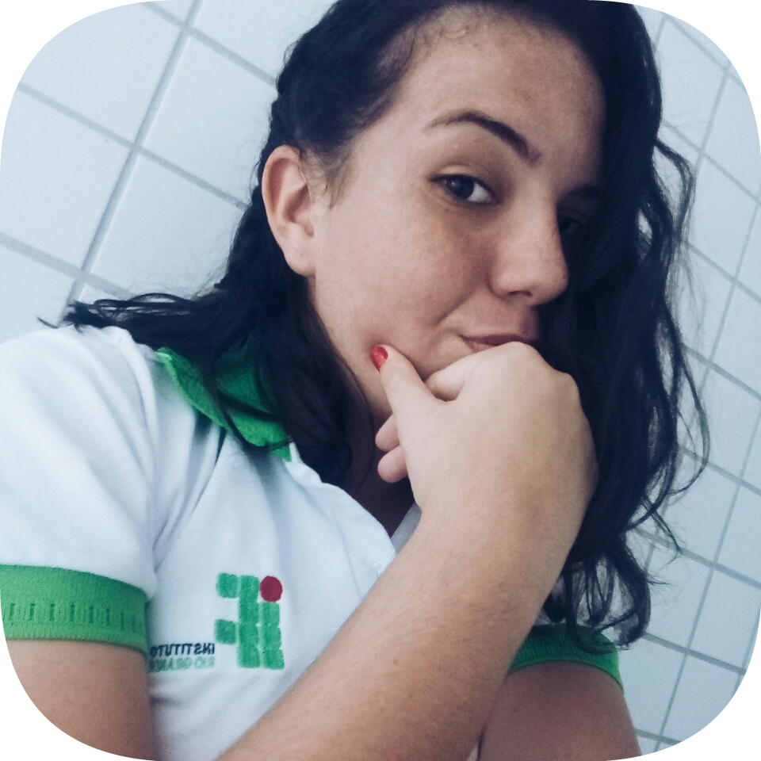
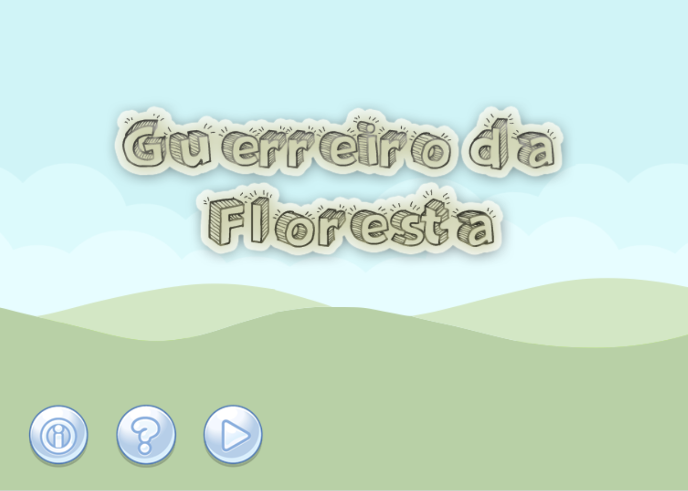
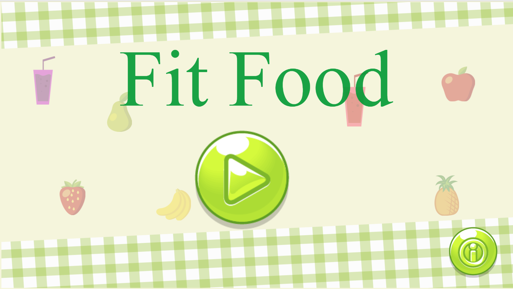

## Quem sou eu?
  Sou Maria Beatriz, estudante do Curso Técnico de Programação de Jogos Digitais.

#### Contatos: 

* Email pessoal: mrbtrznogueira@gmail.com
* instagram: mabemoraes

## Portfólio 

### Games  
[Jogo 1 Oficina: ](https://emanuellicarine.github.io/GuerreiroDaFloresta/) 

[Jogo 2 Oficina: ](https://mrbtrzmoraes.github.io/FitFood/) 

[Jogo 3 Oficina: ](https://mrbtrzmoraes.github.io/Quiz1/) 

## Participação em eventos:

1.SECITEX (2015), IFRN campus Santa Cruz, com o projeto Cups Song, na modalidade apresentação cultural.   
2.SECITEX (2016), IFRN campus Parnamirim, com o projeto Cups Song, na modalidade apresentação cultural.  
3.Epo games (2016), UFRN-IMD, presenciando durante todo o dia. 
4.MOCITECZN (2017), como expositora na modalidade poster GAMETERAPIA.  

## Projetos: 
1.GAMETERAPIA: UMA FORMA DE UNIR JOGOS DIGITAIS A REABILITAÇÃO DE PACIENTES ACOMETIDOS PELO ACIDENTE VASCULAR ENCEFÁLICO (AVE) - 2017
