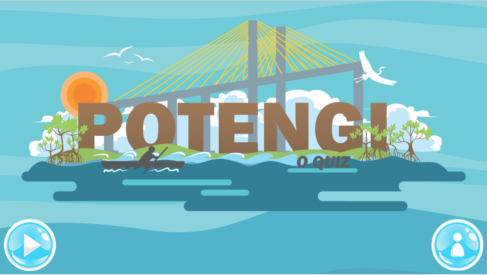

# Quem sou eu

Estudante do curso tecnico de Programação de Jogos Digitais. Atualmente cursando o 3° ano.

# Produções
---
layout: padrão
---
# Configurações do site
Título: Freelancer
email: mrbtrznogueira@gmail.com
url: https: // mrbtrzmoraes.github.io
Descrição: "Escreva uma descrição incrível para o seu novo site aqui. Você pode editar esta linha em _config.yml. Ela apareceá no meta do título do documento (para resultados de pesquisa do Google) e na descrição do site feed.xml".
palavras-chave: "suas palavras-chave, separadas por vírgulas"
habilidades: "Desenvolvedora de Jogos Digitais"
meta_autor: Nogueira Beatriz

# Ferramentas para webmasters do Google
google_verify:

# https://ssl.bing.com/webmaster/configure/verify/ownership Opção 2 content = vai aqui
bing_verify:

# Formulário de contato:
# - estático: passe através de formspree.io para validar o envio de e-mail
# - disqus: substitua o formulário de contato por segmento disqus
# - comente a linha abaixo se quiser com o formulário de contato padrão PHP
contato: estático

# Se você usa disqus, você precisa de disqus shortname
# https://help.disqus.com/customer/portal/articles/466208
disqus_shortname: myshortname

# Configurações de núcleos (hex-codes sem um hash-tag líder)
cor:
  primário: 18bc9c # 80B3FF
  primary-rgb: "24,288,156" # "128,179,255"
  secundário: 2c3e50 # FD6E8A
  secundário-escuro: 233140 # A2122F

# Configurações de rodapé
rodapé:
  direitos autorais: Dr. Henry Jekyll
  Localização: Localização
  social: na internet
  Créditos: Créditos

# Números de usuários de redes sociais (mais mais disponíveis: google-plus, flickr, dribbble, pinterest, instagram, tumblr, linkedin, etc.)
social:
  - título: twitter
    url: http://twitter.com/jekyllrb
  - título: facebook
    url:
  - título: estouro de pilha
    url: http://stackoverflow.com/questions/tagged/jekyll
  - título: bitbucket
    url: http://bitbucket.org/jekyll
  - título: github
    url: http://github.com/jekyll

# Endereço postal (adicione tantas linhas quanto necessário)
endereço:
  - linha: 3481 Melrose Place
  - linha: Beverly Hills, CA 90210

# Conteúdo de Créditos
Créditos: 'Freelancer e Um tema de Bootstrap de código Aberto grátis para Usar CRIADO POR < a  href = " http://startbootstrap.com " > Inicie o Bootstrap </ a >. '

# Configurações de compilação
markdown: kramdown
permalink: bonito
## Games
[Jogo 1 Oficina : GUERREIRO DA FLORESTA](https://emanuellicarine.github.io/GuerreiroDaFloresta/)  

[Jogo 2 Oficina : FIT FOOD](https://mrbtrzmoraes.github.io/FitFood/)    

[Jogo 3 oficina : ](https://mrbtrzmoraes.github.io/Quiz1/)

## Artes

## Apresentações
 

* * *

** negrito  
_ italico  
~~ riscado  
  dois espaçoes para pular linha  
3* adiciona uma linha horizontal  
#s uma ou mais hashtags criam capitulos ou sub  
*s astericos adicionam uma lista não enumerada  
1s numeros adicionam uma lista enumerada  

* * *
